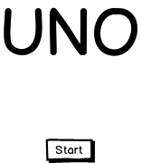
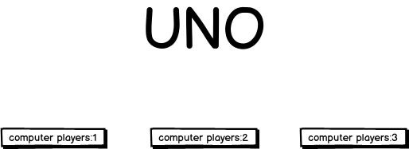
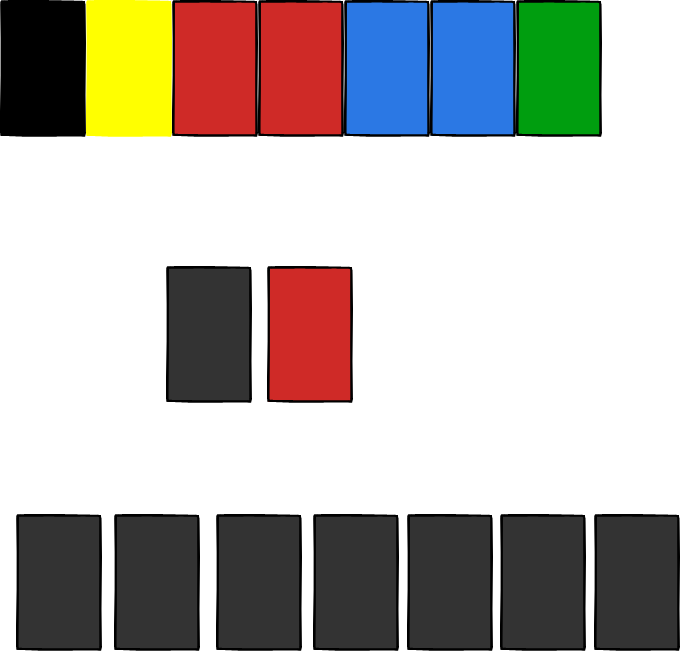
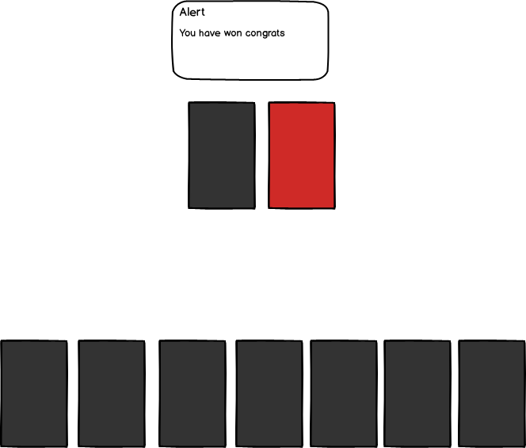
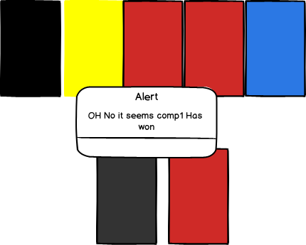
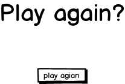

## Project 0

## The ProJect: Uno

The Project will be a browser card game, based on the game Uno. The reason why I choose to make Uno was because I really like the game. Not only that but I do believe that this project can demostrate my techical knowledge that I currently have and I in all honesty will be fun to produce the game

____

## Scope

    The final version of this game will have all the card from UNO working which includes the +2 ,+4, reverse , and skip  to work for player and computers player and can see all four cumputer cards.  Unfornatenly due to limited time for this project they will updated version of this game each including a new feature and bug fix.

##### Technologies in play
    -CSS 
        -flex
    -javascript 
        -vanilla javascript

____

## User Stories:

I. The user will click start and will be greeted with 3 opitions on how many computer he wants to play with
opitions  1 , 2 , or 3.

II. The game will start by dealing out 7 cards to each player.

III.On the first turn a card will be played out by the deck.

IV.starting out with the player they will play a card or if the player can't draw a card and the turn will move clockwise.

V.The computer will play a card and if they can't draw a card.

VI.This will go on until the player or one of the computer has two card left they must call uno before playing the card

VII.The game will end when one of the players has no card left in their hand and they will be declared the winner

VIII. Then the screen will clear and shows who has wong the game(WIP)

IX. After this it will clear and show a button saying to play again?(WIP)

____

## Wire Frames

## WIP Features
-show all 3 computer hands when player picks a amount of computer

-have reverse and skip logic 

-have backing of cards with UNO logo

-better computer logics

-better css 

